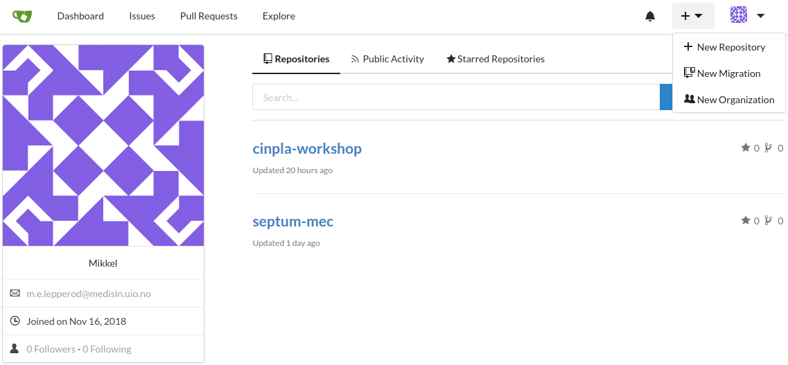
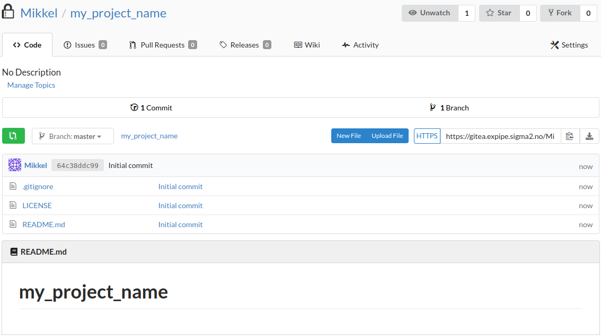

# Welcome!

This repository is a template you can use to *create new projects*.

IMPORTANT: If you are going to work on an existing project, do not clone this repository. You need to look for the repository for that project.

# Installation
Install GIT [Windows](https://git-scm.com/downloads)

Install [Anaconda](https://www.anaconda.com/download/#linux)

Install [Github Desktop](https://desktop.github.com/), if you do not like to use the terminal so much.
 * [Setup](https://help.github.com/desktop/guides/getting-started-with-github-desktop/setting-up-github-desktop/)

Install [Atom](https://atom.io/)

### Cloning the cinpla-base repository
This can either be done with Github Desktop
or with a terminal. When we say terminal, in Windows we mean Anaconda prompt.
However, all code that starts with `git` can be done with Github Desktop.

Make a folder where you want to have it, e.g. c:\apps\

With the terminal run

~~~~~~~~~~~~~~~~~~~~~~~~~~~~~~~~~~~~~~~~~~~~~~~~~~~~~~~~~~~~~~~
cd c:\apps
git clone https://github.com/CINPLA/cinpla-base.git
~~~~~~~~~~~~~~~~~~~~~~~~~~~~~~~~~~~~~~~~~~~~~~~~~~~~~~~~~~~~~~~

### Anaconda
Windows: Search for anaconda and open Anaconda prompt.

Mac: open a terminal

Create a new Anaconda environment with (replace `myproject` with the name of your project):

```
conda create -n myproject python=3.5
```

Then, enter the environment using

```
source activate myproject
```


## Installing expipe for CINPLA
Navigate to where you have cloned `cinpla-base`, then install the `cinpla-base`
requirements

~~~~~~~~~~~~~~~~~~~~~~~~~~~~~~~~~~~~~~~~~~~~~~~~~~~~~~~~~~~~~~~
cd cinpla-base
pip install -r requirements.txt
~~~~~~~~~~~~~~~~~~~~~~~~~~~~~~~~~~~~~~~~~~~~~~~~~~~~~~~~~~~~~~~

## Installing spike sorting tools
Navigate to where you have cloned `cinpla-base`, then install the `cinpla-base`
requirements-spiketools

~~~~~~~~~~~~~~~~~~~~~~~~~~~~~~~~~~~~~~~~~~~~~~~~~~~~~~~~~~~~~~~
cd cinpla-base
pip install -r requirements-spiketools.txt
~~~~~~~~~~~~~~~~~~~~~~~~~~~~~~~~~~~~~~~~~~~~~~~~~~~~~~~~~~~~~~~

#### Installing KiloSort and Ironclust

KiloSort and Ironclust are matlab-based spike sorters. To install them navigate to `C:\apps` and run:

~~~~~~~~~~~~~~~~~~~~~~~~~~~~~~~~~~~~~~~~~~~~~~~~~~~~~~~~~~~~~~~
git clone https://github.com/cortex-lab/KiloSort.git
git clone https://github.com/kwikteam/npy-matlab.git
git clone https://github.com/jamesjun/ironclust.git
~~~~~~~~~~~~~~~~~~~~~~~~~~~~~~~~~~~~~~~~~~~~~~~~~~~~~~~~~~~~~~~

In order to let the system know where these packages are installed we have to set environment variables. If you have admin access, in Windows, select `start-->Computer-->right-click-->Properties`. Then click on `Advanced settings-->Environment variables` and add this three `New` variables:
~~~~~~~~~~~~~~~~~~~~~~~~~~~~~~~~~~~~~~~~~~~~~~~~~~~~~~~~~~~~~~~
name: KILOSORT_PATH     variable: C:\apps\KiloSort
name: NPY_MATLAB_PATH   variable: C:\apps\npy-matlab
name: IRONCLUST_PATH    variable: C:\apps\ironclust
~~~~~~~~~~~~~~~~~~~~~~~~~~~~~~~~~~~~~~~~~~~~~~~~~~~~~~~~~~~~~~~

In case you don't have admin access you can set temporary environment variables from the anaconda prompt by running:
~~~~~~~~~~~~~~~~~~~~~~~~~~~~~~~~~~~~~~~~~~~~~~~~~~~~~~~~~~~~~~~
set KILOSORT_PATH=C:\apps\KiloSort
set NPY_MATLAB_PATH=C:\apps\npy-matlab
set IRONCLUST_PATH=C:\apps\ironclust
~~~~~~~~~~~~~~~~~~~~~~~~~~~~~~~~~~~~~~~~~~~~~~~~~~~~~~~~~~~~~~~


# Getting started

### Register a Gitea account
 * Contact Mikkel, Alessio or Svenn-Arne
 * Navigate to [Gitea and expipe on NIRD](https://gitea.expipe.sigma2.no/)

### Create an expipe repository
 * Initialize with .gitignore, licence and README

<!-- <p><em>Click New repository.</em></p> -->


<!-- <p><em>Enter information.</em></p> -->


<!-- <p><em>Get the URL.</em></p> -->


### Clone repository
 * from notebook (see example below)
 * with git desktop


~~~~~~~~~~~~~~~~~~~~~~~~~~~~~~~~~~~~~~~~~~~~~~~~~~~~~~~~~~~~~~~
git clone https://gitea.expipe.sigma2.no/user_name/my_project_name.git
~~~~~~~~~~~~~~~~~~~~~~~~~~~~~~~~~~~~~~~~~~~~~~~~~~~~~~~~~~~~~~~

### Open jupyter notebook inside repository
Navigate to `my_project_name` and write in the terminal

~~~~~~~~~~~~~~~~~~~~~~~~~~~~~~~~~~~~~~~~~~~~~~~~~~~~~~~~~~~~~~~
jupyter notebook
~~~~~~~~~~~~~~~~~~~~~~~~~~~~~~~~~~~~~~~~~~~~~~~~~~~~~~~~~~~~~~~

In stead of using the terminal from now on, commands can be run from within the
notebook if it is begun with an exclamation mark. That is, if you would write
`expipe init` in the terminal, you would write in the notebook


~~~~~~~~~~~~~~~~~~~~~~~~~~~~~~~~~~~~~~~~~~~~~~~~~~~~~~~~~~~~~~~
expipe init
~~~~~~~~~~~~~~~~~~~~~~~~~~~~~~~~~~~~~~~~~~~~~~~~~~~~~~~~~~~~~~~

This command adds actions, entities and templates folders together with an
`expipe.yaml`, this is necesarry so that `my_project_name` will be recognized as
a expipe project.

## Git LFS
Next, we need to add some information to `git LFS` which is helping us handling
large files (LFS stands for Large File Storage)


~~~~~~~~~~~~~~~~~~~~~~~~~~~~~~~~~~~~~~~~~~~~~~~~~~~~~~~~~~~~~~~
git lfs install
git lfs track actions/*/data/**/*
~~~~~~~~~~~~~~~~~~~~~~~~~~~~~~~~~~~~~~~~~~~~~~~~~~~~~~~~~~~~~~~

This command adds a file, `.gitattributes`, with the following contents

~~~~~~~~~~~~~~~~~~~~~~~~~~~~~~~~~~~~~~~~~~~~~~~~~~~~~~~~~~~~~~~
actions/*/data/**/* filter=lfs diff=lfs merge=lfs -text
*.yaml !filter !diff !merge
~~~~~~~~~~~~~~~~~~~~~~~~~~~~~~~~~~~~~~~~~~~~~~~~~~~~~~~~~~~~~~~

The first line says that all the contents in all `data` directories whithin every
action should be handeled by git LFS. The second line says that even though all
the `data` directories should be handeled by LFS, all files ending with `.yaml`
should not be handeled by LFS.

In short, these lines ensures that all file except `.yaml` files will be downloaded
as LFS files when the repository is cloned or pulled if nothing else is specified.
This means that all files in `data` except `.yaml` files will be text files
pointing to the real data files on NIRD.

To avoid downloading the original files when doing a `git pull` the following command adds `.lfsconfig`
with a line specifying to exclude all LFS tracked files.

~~~~~~~~~~~~~~~~~~~~~~~~~~~~~~~~~~~~~~~~~~~~~~~~~~~~~~~~~~~~~~~
git config -f .lfsconfig lfs.fetchexclude "*"
~~~~~~~~~~~~~~~~~~~~~~~~~~~~~~~~~~~~~~~~~~~~~~~~~~~~~~~~~~~~~~~

~~~~~~~~~~~~~~~~~~~~~~~~~~~~~~~~~~~~~~~~~~~~~~~~~~~~~~~~~~~~~~~
git add -A
git commit -am "init expipe and LFS"
~~~~~~~~~~~~~~~~~~~~~~~~~~~~~~~~~~~~~~~~~~~~~~~~~~~~~~~~~~~~~~~

### Setting up LFS
If you get lfs-timeout errors when pushing (i/o timeout, error: failed to push some refs), consider changing your lfs settings to with

~~~~~~~~~~~~~~~~~~~~~~~~~~~~~~~~~~~~~~~~~~~~~~~~~~~~~~~~~~~~~~~
git config lfs.tlstimeout 300
git config lfs.activitytimeout 60
git config lfs.dialtimeout 600
git config lfs.concurrenttransfers 1
~~~~~~~~~~~~~~~~~~~~~~~~~~~~~~~~~~~~~~~~~~~~~~~~~~~~~~~~~~~~~~~

### Add templates
Navigate to `cinpla-base/src/expipe-templates-cinpla/templates`, where you'll
find a bunch of example templates, copy some you want to use or write your own.
If you want to write your own template the filename must on the form
`filename.yaml` and at a minimum contain


~~~~~~~~~~~~~~~~~~~~~~~~~~~~~~~~~~~~~~~~~~~~~~~~~~~~~~~~~~~~~~~
name: filename
identifier: filename
~~~~~~~~~~~~~~~~~~~~~~~~~~~~~~~~~~~~~~~~~~~~~~~~~~~~~~~~~~~~~~~

It is probably wise to commit after you add the templates.

~~~~~~~~~~~~~~~~~~~~~~~~~~~~~~~~~~~~~~~~~~~~~~~~~~~~~~~~~~~~~~~
git add -A
git commit -am "added some templates"
~~~~~~~~~~~~~~~~~~~~~~~~~~~~~~~~~~~~~~~~~~~~~~~~~~~~~~~~~~~~~~~

And now push your changes:

~~~~~~~~~~~~~~~~~~~~~~~~~~~~~~~~~~~~~~~~~~~~~~~~~~~~~~~~~~~~~~~
git push
~~~~~~~~~~~~~~~~~~~~~~~~~~~~~~~~~~~~~~~~~~~~~~~~~~~~~~~~~~~~~~~

## Working with expipe
Now you are ready to start using expipe


### Open cinpla browser

~~~~~~~~~~~~~~~~~~~~~~~~~~~~~~~~~~~~~~~~~~~~~~~~~~~~~~~~~~~~~~~
from expipe_plugin_cinpla.widgets import browser
browser.display('workshop')
~~~~~~~~~~~~~~~~~~~~~~~~~~~~~~~~~~~~~~~~~~~~~~~~~~~~~~~~~~~~~~~

You can register actions (surgery, adjustments, recordings, perfusions, etc.) and process data using the jupyter GUI.
Once you have worked on the repo, you should `git add` the changed files, `git commit`   and `git push`.

If you want to physically download the files of an action to perform analysis, for example, first you need to pull the required files:

~~~~~~~~~~~~~~~~~~~~~~~~~~~~~~~~~~~~~~~~~~~~~~~~~~~~~~~~~~~~~~~
git pull
git lfs fetch -I path-to-action
git lfs checkout
~~~~~~~~~~~~~~~~~~~~~~~~~~~~~~~~~~~~~~~~~~~~~~~~~~~~~~~~~~~~~~~

 or equivalently
 
 ~~~~~~~~~~~~~~~~~~~~~~~~~~~~~~~~~~~~~~~~~~~~~~~~~~~~~~~~~~~~~~~
git -c lfs.fetchexclude="" lfs pull -I path-to-action
~~~~~~~~~~~~~~~~~~~~~~~~~~~~~~~~~~~~~~~~~~~~~~~~~~~~~~~~~~~~~~~

If you want to download all files:

~~~~~~~~~~~~~~~~~~~~~~~~~~~~~~~~~~~~~~~~~~~~~~~~~~~~~~~~~~~~~~~
git lfs fetch --all
git lfs checkout
~~~~~~~~~~~~~~~~~~~~~~~~~~~~~~~~~~~~~~~~~~~~~~~~~~~~~~~~~~~~~~~

Once you have pushed everything, if you want to free some space you can delete your actions and run (do it with caution!!!):

~~~~~~~~~~~~~~~~~~~~~~~~~~~~~~~~~~~~~~~~~~~~~~~~~~~~~~~~~~~~~~~
git reset --hard
~~~~~~~~~~~~~~~~~~~~~~~~~~~~~~~~~~~~~~~~~~~~~~~~~~~~~~~~~~~~~~~

### Open expipe browser

You can check the status of your expipe project using the expipe Browser:

~~~~~~~~~~~~~~~~~~~~~~~~~~~~~~~~~~~~~~~~~~~~~~~~~~~~~~~~~~~~~~~
import expipe
expipe.Browser('workshop').display()
~~~~~~~~~~~~~~~~~~~~~~~~~~~~~~~~~~~~~~~~~~~~~~~~~~~~~~~~~~~~~~~


# Troubleshooting

## gitea

If you want to store your credentials do

~~~~~~~~~~~~~~~~~~~~~~~~~~~~~~~~~~~~~~~~~~~~~~~~~~~~~~~~~~~~~~~
git config credential.helper store
git pull
~~~~~~~~~~~~~~~~~~~~~~~~~~~~~~~~~~~~~~~~~~~~~~~~~~~~~~~~~~~~~~~
Type in your credentials and it is then stored.

Sometimes when cloning, pulling, or pushing to gitea you might get this error:
~~~~~~~~~~~~~~~~~~~~~~~~~~~~~~~~~~~~~~~~~~~~~~~~~~~~~~~~~~~~~~~~~~~~~~~~~~~~~~~~~~~~~~~~~~~~~~~~~~~~~~~~~~~~~~~~~~~~~
fatal: unable to access 'https://gitea.expipe.sigma2.no/username/project.git/': The requested URL returned error: 403
~~~~~~~~~~~~~~~~~~~~~~~~~~~~~~~~~~~~~~~~~~~~~~~~~~~~~~~~~~~~~~~~~~~~~~~~~~~~~~~~~~~~~~~~~~~~~~~~~~~~~~~~~~~~~~~~~~~~~

This can be solved by changing the repo name copied from gitea:

`https://gitea.expipe.sigma2.no/username/project.git/` 

to 

`https://username@gitea.expipe.sigma2.no/username/project.git/`

If your `.git` folder gets huge, you can delete old LFS files from local storage with (make sure you are sync with remote (all files are pushed))

`git lfs prune`

## python

- if you get a `multiarray error` when running `expipe init` run:
~~~~~~~~~~~~~~~~~~~~~~~~~~~~~~~~~~~~~~~~~~~~~~~~~~~~~~~~~~~~~~~
pip uninstall numpy
pip install numpy
~~~~~~~~~~~~~~~~~~~~~~~~~~~~~~~~~~~~~~~~~~~~~~~~~~~~~~~~~~~~~~~

